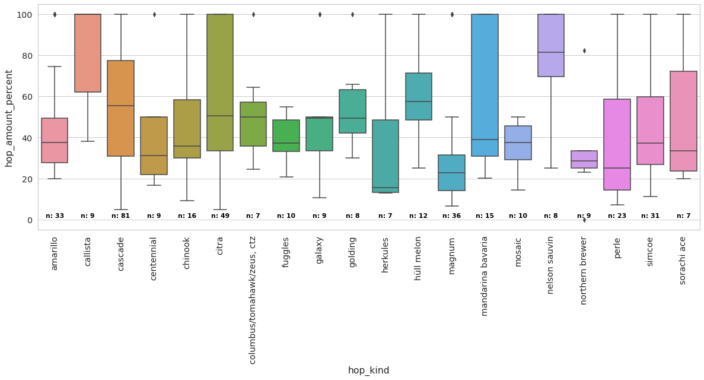

beer-recipe-analysis 🍺
======================

Playing around with Python to **analyze beer brewing recipes**.

The goal of this project is to use the power of data analysis to get a better idea how different styles of beer are
brewed. Among other things, I want to find out which ingredients are commonly used and how much in relation to each
other.

Requirements
------------

- Python 3
- tqdm
- pandas
- matplotlib
- seaborn

Usage
-----

1) Load the data:

```bash
./bin/load_data.sh
```

2) Start Jupyter Labs in the project root

3) Run the notebooks from the `ipynb` folder

Results
-------

Run the Jupyter notebooks to see the results. The notebooks have a variable to generate results for a different beer
style. Per default it's analyzing the `pale ale` beer style.

### [Malts used](notebooks/malts.ipynb)


### [Hops used](notebooks/hops.ipynb)



License
-------

This software is available under the [WTFPL License](LICENSE).
